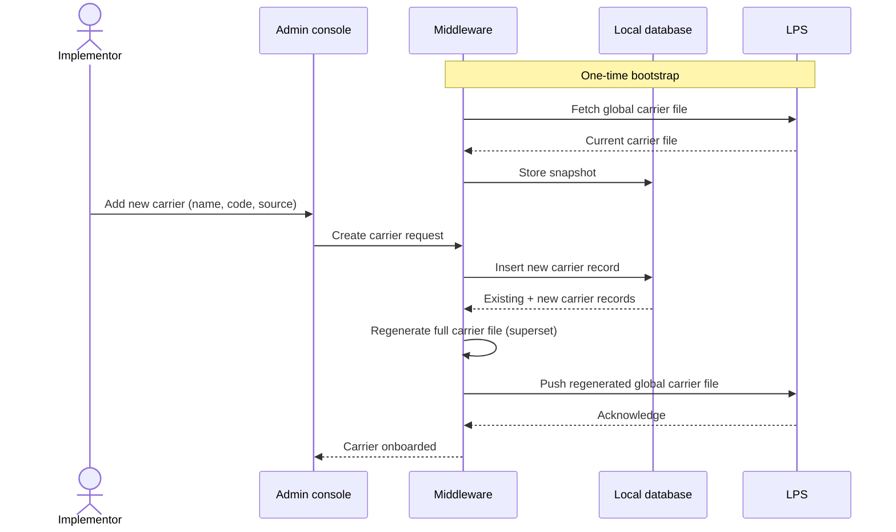
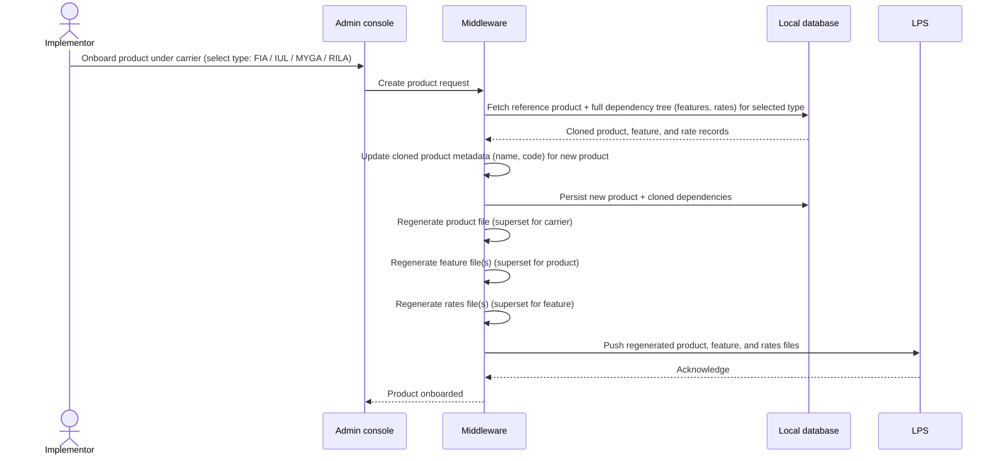
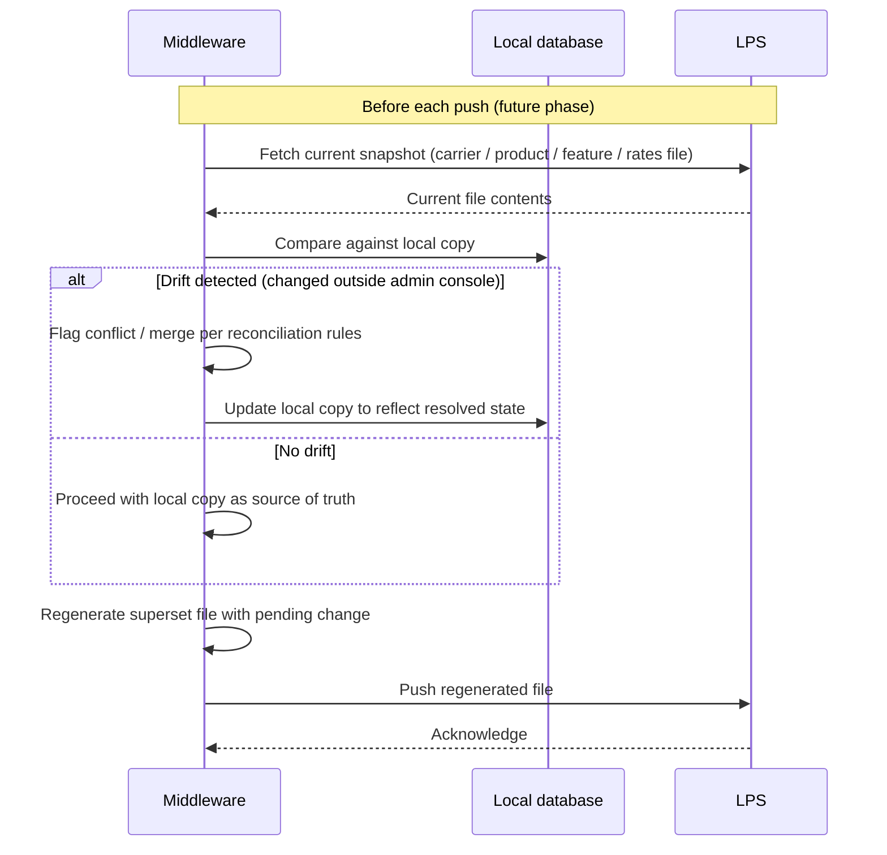

# LPS integration — configuration management

*High-level solution for carrier and product onboarding, with a path toward partial configuration updates.*

## Background

We are building an integration with LPS, the system used to calculate policy values based on the features, riders, funds, and rates configured for a product. LPS stores all of its configuration — carriers, products, features, riders, funds, and rates — as files that are loaded into memory at runtime to perform these calculations.

## Problem statement

LPS only supports full file replacement for configuration changes; it has no native support for partial updates. Any change to a single carrier, product, feature, or rate requires regenerating and pushing the entire file, which is operationally heavy and risks unrelated data being overwritten. Working around this limitation is a primary driver of this integration.

## Configuration file structure

Discovery with the LPS team surfaced a four-level file hierarchy. Each file is cumulative at its level — it holds every record for that scope, not just the record being changed.

| File | Scope | Contents |
|---|---|---|
| Global carrier file | All carriers | Carrier name/code and source system (Lifecad, FAST) |
| Cumulative product file | Per carrier | Product names and codes |
| Cumulative feature file | Per product, per carrier | Feature names and codes |
| Cumulative rates file | Per feature, per product, per carrier | Rates for that feature |

## Proposed solution

### Admin console middleware

An admin console middleware layer sits between the admin console and LPS. It maintains a local database that mirrors the current state of LPS's configuration files. Rather than editing LPS files directly, the middleware updates its local copy, regenerates the affected file as a full superset, and pushes that file to LPS. This preserves LPS's full-replacement contract while giving the admin console an editable, incremental experience — effectively simulating partial updates at the middleware layer.

### Carrier onboarding

1. Middleware takes an initial snapshot of the global carrier file from LPS and stores it in the local database.
2. When a new carrier is onboarded through the admin console, it is added to the local copy.
3. Middleware regenerates the full global carrier file — existing carriers plus the new one — and pushes the superset to LPS.

### Product onboarding — clone and go

Initial scope covers onboarding a carrier together with its products, not standalone features, riders, or rates. To satisfy product dependencies without building full configuration authoring at every level, the middleware uses a clone-and-go approach: it keeps a complete reference copy of each supported product type — FIA, IUL, MYGA, and RILA — and its full dependency tree in the local database.

1. Implementor selects a product type (FIA, IUL, MYGA, or RILA) as the template for the new product.
2. Middleware clones that product and all of its dependencies (features and rates) from the local database.
3. Middleware updates the cloned product's metadata — name and code — to match the product being onboarded.
4. Middleware pushes the updated product and its cloned dependencies to LPS as full superset files.

### Day 2 — reconciliation

To keep the local database consistent if LPS is changed outside the admin console, a later phase will have the middleware re-pull the current snapshot from LPS before each update and reconcile it against the local copy, so the superset pushed back does not silently overwrite out-of-band changes.

## Scope

### In scope — phase 1

- Carrier onboarding via the global carrier file
- Product onboarding via clone-and-go for FIA, IUL, MYGA, and RILA
- Local database as the middleware's system of record for admin-console-driven changes

### Out of scope — phase 1

- Adding or editing features, riders, or rate configuration directly in LPS
- Day 2 reconciliation pull from LPS (planned for a later phase)
- Authoring net-new product types outside the four supported templates

## Open items

- Confirm the LPS file schema (XSD or equivalent) to define the full superset of allowed attributes per file type
- Define reconciliation and conflict-resolution rules for day 2 sync
- Define rollback behavior if a push to LPS fails partway — for example, the product file succeeds but the rates file fails
- Define concurrency handling for simultaneous onboarding requests
